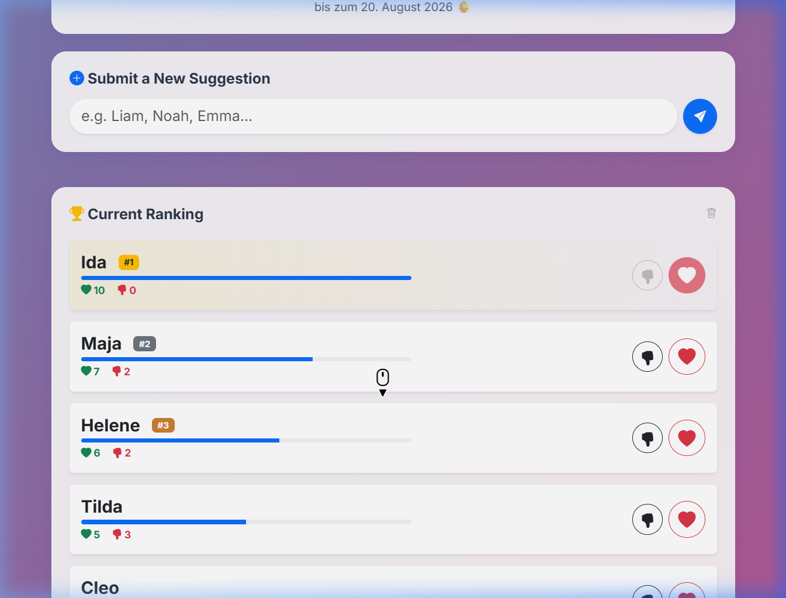

# Awesome Baby Dashboard

A personalized family web dashboard created to engage friends and family during a pregnancy. Features include a name voting system, a baby attributes betting game, an integrated wishlist, and a digital flea market for offerings.



## Features

- **Countdown & Size Tracker:** 
  Visual countdown to the due date alongside a fun weekly size comparison (e.g., "Size of an avocado").
- **Name Voting System:**
  Suggest names and vote (upvote/downvote). Displays ranking by net score with dynamic progress bars. Prevents multiple votes from the same user using IP tracking.
- **Wishlist:**
  List items needed for the baby. Friends and family can reserve items ("I'll get it!") to avoid duplicates.
- **Betting Game:**
  Guess the baby's birth weight, size, date, and time. Displays the crowd's average guess for fun comparison.
- **Flea Market (Offers):**
  A place for users to upload photos of items they wish to gift, lend, or hand down to the family. Images are automatically compressed before upload.

## Tech Stack

*   **Frontend:** HTML5, CSS3, Vanilla JavaScript, Bootstrap 5 (UI Framework)
*   **Backend:** Node.js, Express.js
*   **Data Storage:** Local JSON files (`names.json`, `wishlist.json`, `bets.json`, `offers.json`) for zero-database reliance. Image uploads are stored locally.
*   **Deployment:** Docker & Docker Compose

## Getting Started

### Prerequisites

*   [Docker](https://docs.docker.com/get-docker/) & [Docker Compose](https://docs.docker.com/compose/install/)

### Installation & Setup

1.  **Clone the repository:**
    ```bash
    git clone https://github.com/yourusername/awesome-baby-dashboard.git
    cd awesome-baby-dashboard
    ```

2.  **Configuration:**
    Copy the example configuration file and adjust the environment variables:
    ```bash
    cp docker-compose.example.yml docker-compose.yml
    ```
    
    Edit `.env` or set the variables directly in `docker-compose.yml`:
    *   `ADMIN_PIN`: The PIN code required for administrative actions (deleting entries). (Default: 2026)
    *   `DUE_DATE`: The expected due date for the countdown in format `YYYY-MM-DDTHH:mm:ss`. (Default: 2026-08-20T00:00:00)
    *   `APP_TITLE`: The title of the app displayed in the browser tab and main header. (Default: 👶 Baby-Dashboard)

3.  **Run the application:**
    ```bash
    docker-compose up -d --build
    ```

    The app will be accessible at `http://localhost:8093` (or the port specified in your `docker-compose.yml`).

## Security

*   **Input Sanitization:** Basic XSS prevention encoding for all text inputs.
*   **Rate Limiting:** Protects the endpoints from spam.
*   **IP Tracking:** Voting integrity is ensured by tracking IPs server-side.

## License

This project is open-source and available under the [MIT License](LICENSE).
